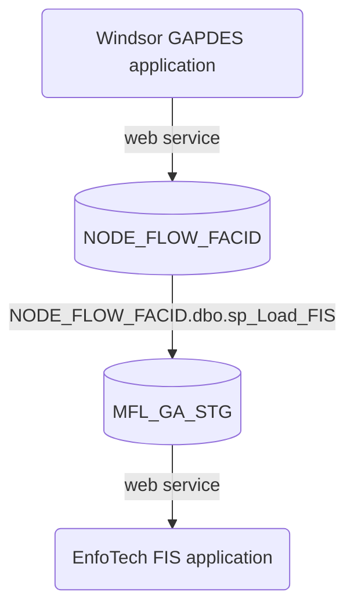
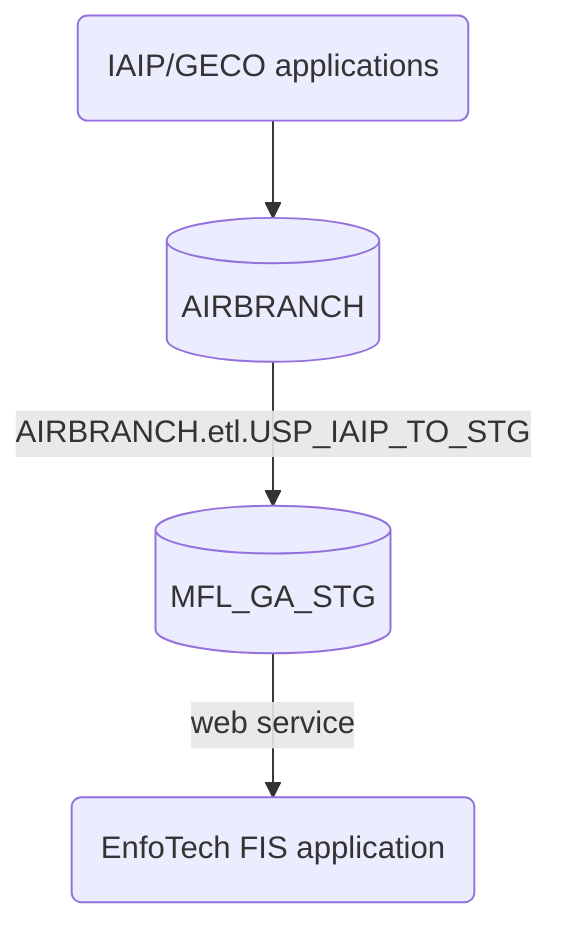
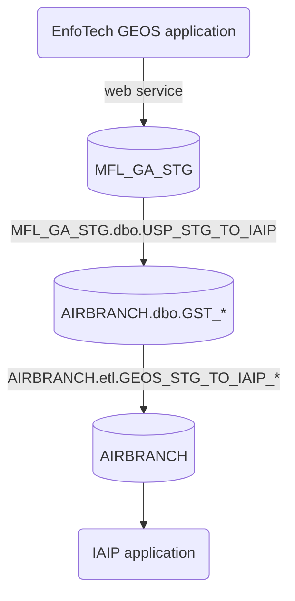
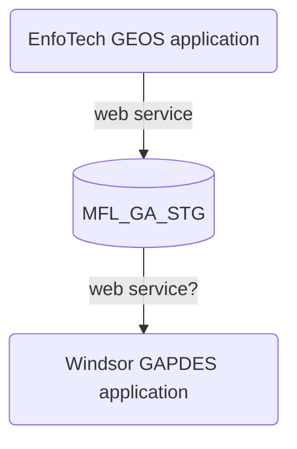
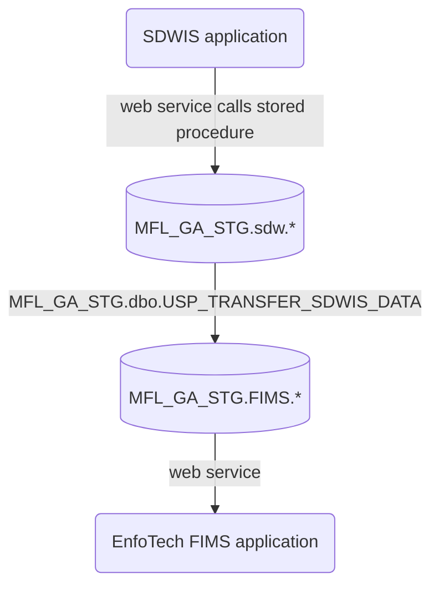
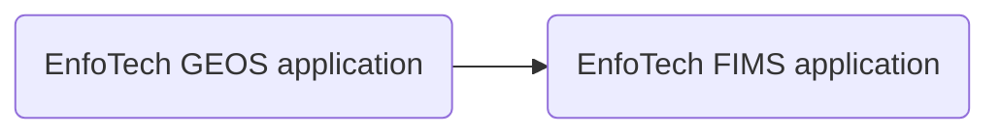
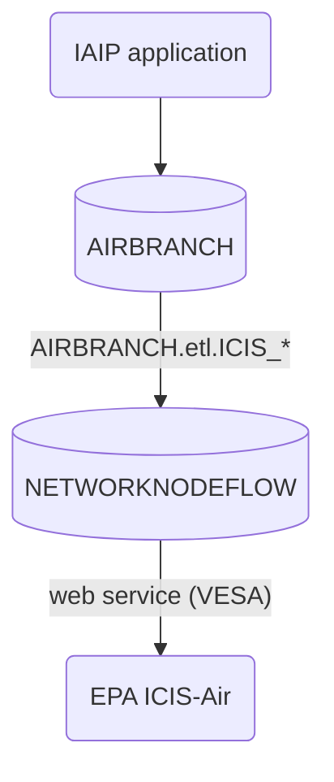
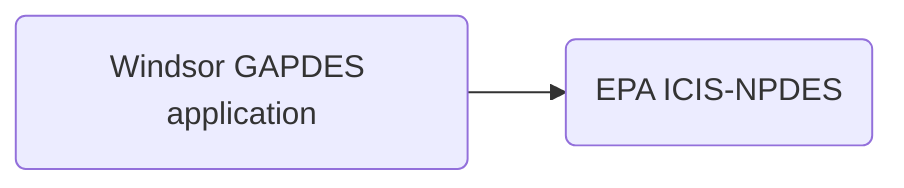

Brief outlines of each data exchange we manage.

See also:

* [Diagram of all data exchanges](data-exchange-diagram.pdf) (original at `\\dnr-n3400-05a\dnr-tt-dat\SHARED\DO\EPD DOIT\Data Exchanges\Diagrams\`)
* [Description of web services](web-services.html)

## FIS (Facility Identification System)

👉 EPD facility info sent to Enfotech

### GAPDES (Georgia Pollution Discharge Elimination System)

### Air Branch

## GEOS (Georgia EPD Online System)

👉 Permit application info received from Enfotech

### Air Branch

### GAPDES

* NPDES Municipal (in production)
* NPDES Industrial (still in planning)
* Stormwater Construction (soon)
* Stormwater Industrial (under development)

## FIMS (Financial Information Management System)

👉 Fee info sent to Enfotech

### SDWIS (Safe Drinking Water Information System)

### GAPDES

## EIS (Emissions Inventory System)

👉 The Emissions Inventory is now handled by EPA's CAERS.

## ICIS (Integrated Compliance Information System)

👉 Facility, enforcement, and permitting data sent to EPA

### ICIS-Air

### ICIS-NPDES

