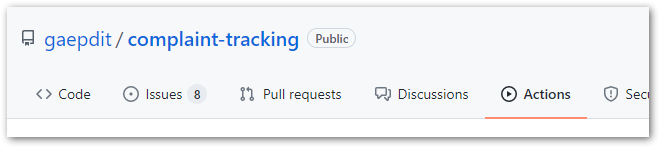
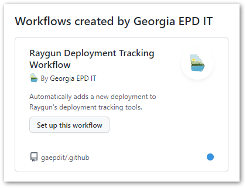
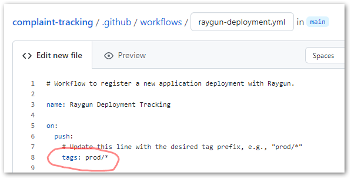
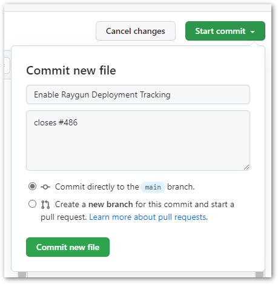
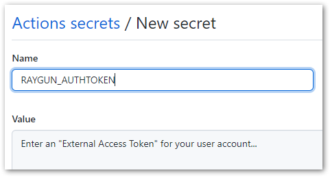
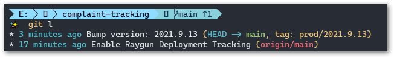
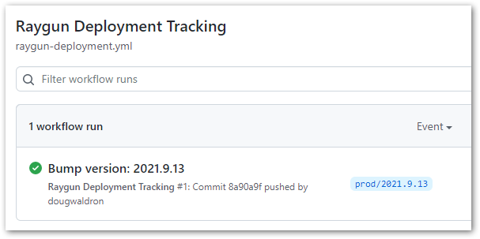
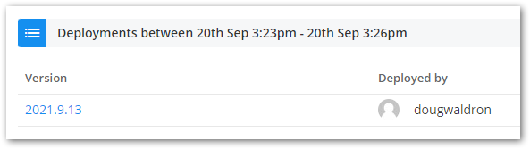

# Tracking Deployments in Raygun

Raygun is an application error reporting and performance monitoring service. Though not mandatory, adding [deployment information to Raygun](https://raygun.com/platform/deployment-tracking) enables additional features for monitoring software health. A GitHub action is available to automate this.

Raygun deployment tracking correlates deployment information for application releases with version information sent with error reports.

## Setup

1. To add the GitHub action to your repository, go to the "Actions" tab on the repo webpage.

    

2. Look for and select the "Raygun Deployment Tracking Workflow" action.

    

3. Review the workflow file and update the tag version prefix if needed.

    

4. Click "Start commit" and update the commit message and description as desired.

    

5. Go to the "Settings" tab on the repo, select "Secrets", and add two new "Actions secrets":

    * `RAYGUN_AUTHTOKEN` is an "External Access Token" generated in your [Raygun user account](https://app.raygun.com/user).
    * `RAYGUN_APIKEY` is the API Key found in the Raygun application settings.

    

## Tracking App Deployment

There are two steps for tracking software deployment in Raygun:

1. *Set a version number in your application.* The version number is automatically sent to Raygun with each error report when an exception occurs in the application. In .NET projects, the version number can be set by specifying the [`AssemblyVersion` attribute](https://docs.microsoft.com/en-us/troubleshoot/visualstudio/general/assembly-version-assembly-file-version) in the project file.

2. *Add a version tag to the repository.* The GitHub action above will be triggered when a new version tag is pushed to the repository. Version tags should begin with a prefix, for example, `prod/1.0.0` or `v/1.0.0`. The prefix is specified in the GitHub action, and the version number in the tag should match the application version number.

## Results

After pushing a new release/tag, you can verify that the action successfully ran by visiting the Actions tab in the repo and the Deployments tab in the Raygun application.

 

