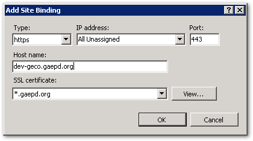
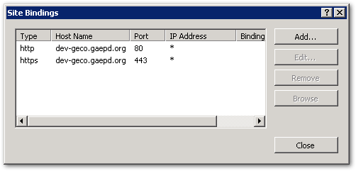

# Using HTTPS Is Required

*All Georgia EPD websites and web applications **MUST** be served over HTTPS only (including dev and test sites).*

Summary: An SSL certificate for `*.gaepd.org` is installed on all web servers. The URL Rewrite IIS module is also installed, making it easy to set up redirection for HTTP requests.

## Why use HTTPS? 

HTTPS helps protect the privacy and security of your users, even if personal information is not being transmitted. Also, HTTPS is required for many newer technologies (e.g., service workers, geo-location).

> Every unencrypted HTTP request reveals information about a user’s behavior, and the interception and tracking of unencrypted browsing has become commonplace. Today, **there is no such thing as non-sensitive web traffic,** and public services should not depend on the benevolence of network operators.
> 
> — <cite>[The HTTPS-Only Standard](https://https.cio.gov/everything/)</cite>

This is especially true for government websites.

> Citizens expect government websites to be secure, trustworthy, and reliable. Citizens expect anything they read on a `.gov` website to be official, and they expect any information they submit to that website — especially if they’re submitting personal information — to be sent safely and only to the government.
>
> — <cite>[Eric Mill, 18F](https://18f.gsa.gov/2014/11/13/why-we-use-https-in-every-gov-website-we-make/)</cite>

This policy applies to Dev and Test sites as well since those sites often still require the use of passwords and often display data copied from the production site. Plus, if you aren't testing under the same conditions that exist in Production, you aren't testing everything.

## How to enable HTTPS for your website

In IIS Manager, select your site and then select "Bindings..." under the Edit Site Actions. Add a new binding, choose "https" for the type, select the "*.gaepd.org" SSL certificate, and enter the host name. 



Each website should have two bindings, one each for HTTP and HTTPS. (The HTTP binding is required so that you can enable redirection.)



*Important note:* The SSL certificate has a wildcard sub-domain, but be aware that this only works for a single sub-domain segment. A sub-sub-domain (like `https://dev.cts.gaepd.org`) will *not* work correctly. Therefore, when creating URLs for test sites, use a hyphenated subdomain (e.g., `https://cts-dev.gaepd.org`).

*Another important note:* The SSL certificate installed does not work for domains other than `gaepd.org`. If you need to use a different domain name, include the purchase and maintenance of a separate SSL certificate in your development costs.

## Ensure your site works correctly

In particular, watch out for hard-coded internal links and mixed security content. Mixed security content occurs when embedded scripts, images, etc. are served from HTTP while the main page is served over HTTPS. See [What Is Mixed Content?](https://developers.google.com/web/fundamentals/security/prevent-mixed-content/what-is-mixed-content) for a more detailed description.

To fix this, search for all instances of `http:` in your source code, verify that an HTTPS version is available for the resource, and then change the
link.

Also, when linking to external sites, it is best practice to link to an HTTPS version if one exists.

## Redirect HTTP requests

* HTTP requests to websites should be seamlessly redirected to an identical request over HTTPS.
* Web APIs should either not listen on HTTP or close the connection with status code 400 (Bad Request).

Once you have verified that the site is fully functional in HTTPS, the last step is to permanently redirect all HTTP traffic to the HTTPS site. The [URL Redirect Module](https://docs.microsoft.com/en-us/iis/extensions/url-rewrite-module/using-the-url-rewrite-module) has been installed on all web servers for this purpose. To enable it, copy this snippet into your web.config file:

```xml
<?xml version="1.0" encoding="utf-8"?>
<configuration>

  <!-- lots of additional stuff not shown... -->
    
  <system.webServer>
    <rewrite>
      <rules>
        <!-- Redirect HTTP to HTTPS. This requires the URL Rewrite module to be installed in IIS. -->
        <rule name="HTTP to HTTPS redirect" stopProcessing="true">
          <match url="(.*)" />
          <conditions>
            <add input="{SERVER_PORT_SECURE}" pattern="^0$" />
          </conditions>
          <action type="Redirect" redirectType="Permanent" url="https://{HTTP_HOST}/{R:1}" />
        </rule>
      </rules>
    </rewrite>
  </system.webServer>
</configuration>
```

This snippet uses a permanent redirect type (301 Moved Permanently).

## Don't forget the cookies

Browser cookies set by your application should be similarly secured. While you have web.config open, add this line:

```xml
<configuration>
  <system.web>
    <httpCookies requireSSL="true" httpOnlyCookies="true"/>
  </system.web>
</configuration>
```