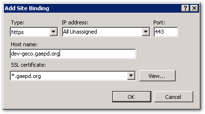
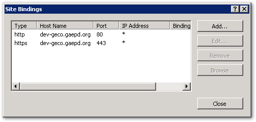
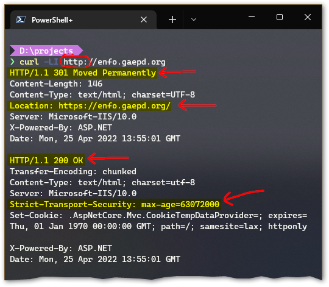

*All Georgia EPD websites and web applications **MUST** be served over HTTPS only (including dev and test sites).*

Summary: An SSL certificate for `*.gaepd.org` is installed on all web servers. The URL Rewrite IIS module is also installed, making it easy to set up redirection for HTTP requests.

* [Why use HTTPS?](#why-use-https)
* [How to enable HTTPS for your website](#how-to-enable-https-for-your-website)
* [How to enable HSTS](#how-to-enable-hsts)
* [Quick check](#quick-check)

## Why use HTTPS?

HTTPS helps protect the privacy and security of your users, even if personal information is not being transmitted. Also, HTTPS is required for many newer technologies (e.g., service workers, geo-location).

> Every unencrypted HTTP request reveals information about a user’s behavior, and the interception and tracking of unencrypted browsing has become commonplace. Today, **there is no such thing as non-sensitive web traffic,** and public services should not depend on the benevolence of network operators.
>
> — <cite>[The HTTPS-Only Standard](https://https.cio.gov/everything/)</cite>

This is especially true for government websites.

> Citizens expect government websites to be secure, trustworthy, and reliable. Citizens expect anything they read on a `.gov` website to be official, and they expect any information they submit to that website — especially if they’re submitting personal information — to be sent safely and only to the government.
>
> — <cite>[Eric Mill, 18F](https://web.archive.org/web/20250226210450/https://18f.gsa.gov/2014/11/13/why-we-use-https-in-every-gov-website-we-make/)</cite>

This policy applies to Dev and Test sites as well since those sites often still require the use of passwords and often display data copied from the production site. Plus, if you aren't testing under the same conditions that exist in Production, you aren't testing everything.

## How to enable HTTPS for your website

In IIS Manager, select your site and then select "Bindings..." under the Edit Site Actions. Add a new binding, choose "https" for the type, select the "*.gaepd.org" SSL certificate, and enter the host name.



Each website should have two bindings, one each for HTTP and HTTPS. (The HTTP binding is required so that you can enable redirection.)



*Important note:* The SSL certificate has a wildcard sub-domain, but be aware that this only works for a single sub-domain segment. A sub-sub-domain (like `https://dev.geco.gaepd.org`) will *not* work correctly. Therefore, when creating URLs for test sites, use a hyphenated subdomain (e.g., `https://dev-geco.gaepd.org`).

*Another important note:* The SSL certificate installed does not work for domains other than `gaepd.org`. If you need to use a different domain name, include the purchase and maintenance of a separate SSL certificate in your development costs.

*Another very important note:* The above configuration applies to web applications, *not APIs.* An API should *only* respond over HTTPS—no HTTP binding should be added for an API.

### Ensure your site works correctly

In particular, watch out for hard-coded internal links and mixed security content. Mixed security content occurs when embedded scripts, images, etc. are served from HTTP while the main page is served over HTTPS. See [What Is Mixed Content?](https://web.dev/articles/what-is-mixed-content) for a more detailed description.

To fix this, search for all instances of `http:` in your source code, verify that an HTTPS version is available for the resource, and then change the link.

Also, when linking to external sites, it is best practice to link to an HTTPS version if one exists.

### Redirect HTTP requests

Once you have verified that the site is fully functional in HTTPS, the next step is to permanently redirect all HTTP traffic to the HTTPS site. 

* HTTP requests to websites should be transparently redirected to an identical request over HTTPS.
* Web APIs should either not listen on HTTP (preferred) or close the connection with status code 400 (Bad Request).

#### Configuring .NET Framework applications

The [URL Redirect Module](https://docs.microsoft.com/en-us/iis/extensions/url-rewrite-module/using-the-url-rewrite-module) has been installed on all web servers for this purpose. To enable it, copy this snippet into your `web.config` file within the `<system.webServer>` element:

```xml
<rewrite>
    <!-- This section requires the URL Rewrite module to be installed in IIS. -->
    <rules>
        <rule name="HTTP to HTTPS redirect">
            <match url="(.*)" />
            <conditions>
                <add input="{SERVER_PORT_SECURE}" pattern="^0$" />
            </conditions>
            <action type="Redirect" redirectType="Permanent"
                url="https://{HTTP_HOST}/{R:1}" />
        </rule>
    </rules>
</rewrite>
```

This snippet uses a permanent redirect type (301 Moved Permanently).

##### Don't forget the cookies

Browser cookies set by your application should be similarly secured. While you have `web.config` open, add this line within the `<system.web>` element:

```xml
<httpCookies requireSSL="true" httpOnlyCookies="true"/>
```

#### Configuring .NET Core applications

The above method will work for all websites running on IIS, but ASP<span>.NET</span> Core offers a [simpler configuration method](https://learn.microsoft.com/en-us/aspnet/core/security/enforcing-ssl) to enable HTTPS redirection that does not require modifying the `web.config` file. Add the following code to the `Program.cs` file.

```csharp
// Optionally configure HTTPS redirection services.
builder.Services.AddHttpsRedirection(options =>
{
    options.HttpsPort = 443;
    options.RedirectStatusCode = StatusCodes.Status308PermanentRedirect;
});

// Build the app.
var app = builder.Build();

// Enable the HTTPS Redirection middleware.
app.UseHttpsRedirection();
```

*Note:* The `308 Permanent Redirect` status code is preferred over the default `301 Moved Permanently`, but either will work.

## How to enable HSTS

Once you've switched to HTTPS and thoroughly tested your site, you should enable HTTP Strict Transport Security (HSTS).

> [HSTS] allows a website to declare itself as a secure host and to inform browsers that it should be contacted only through HTTPS connections. HSTS is an opt-in security enhancement that enforces HTTPS and significantly reduces the ability of man-in-the-middle type attacks to intercept requests and responses between servers and clients.
>
> — <cite>[IIS 10.0 Version 1709 HTTP Strict Transport Security (HSTS) Support](https://learn.microsoft.com/en-us/iis/get-started/whats-new-in-iis-10-version-1709/iis-10-version-1709-hsts#http-strict-transport-security-hsts)</cite>

HSTS is nothing more than a `Strict-Transport-Security` header included with the HTTP response, with a `max-age` value indicating the time in seconds that the browser should cache this setting:

```
Strict-Transport-Security: max-age=<expire-time>
```

#### Configuring .NET Framework applications

The [IIS support document](https://learn.microsoft.com/en-us/iis/get-started/whats-new-in-iis-10-version-1709/iis-10-version-1709-hsts) describes multiple ways HSTS can be enabled at the server level. The following method is valid for our current version of IIS. Within the `<rewrite>` element added above, include the following lines and test thoroughly:

```xml
<outboundRules>
    <rule name="Add STS header when HTTPS" enabled="true">
        <match serverVariable="RESPONSE_Strict_Transport_Security"
            pattern=".*" />
        <conditions>
            <add input="{HTTPS}" pattern="on" ignoreCase="true" />
        </conditions>
        <action type="Rewrite" value="max-age=300" />
    </rule>
</outboundRules>
```

#### Configuring .NET Core applications

Like HTTPS redirection, HSTS is [built into ASP<span>.NET</span> Core](https://learn.microsoft.com/en-us/aspnet/core/security/enforcing-ssl#http-strict-transport-security-protocol-hsts). The following code snippet includes both for your convenience.

```csharp
// Optionally configure HTTPS redirection and HSTS services.
builder.Services
    .AddHsts(options => options.MaxAge = TimeSpan.FromMinutes(5))
    .AddHttpsRedirection(options =>
    {
        options.HttpsPort = 443;
        options.RedirectStatusCode = StatusCodes.Status308PermanentRedirect;
    });

// Build the app.
var app = builder.Build();

// Enable the HSTS middleware.
if (!app.Environment.IsDevelopment())
{
    app.UseHsts();
}

// Enable the HTTPS Redirection middleware.
app.UseHttpsRedirection();
```

#### The `max-age` parameter

In the above examples, the `max-age` value is set at 5 minutes (300 seconds). It is recommended to ramp up the `max-age` value stepwise starting at a small value (like 5 minutes) in order to test the application. Then increase the value to a few hours and leave it in production until you're confident the site is fully functional. Finally, increase `max-age` to a large value, such as 2 years.

| Duration  | HSTS value         |
|-----------|--------------------|
| 5 minutes | `max-age=300`      |
| 1 day     | `max-age=86400`    |
| 2 years   | `max-age=63072000` |

## Quick check

You can quickly check that the above changes have taken effect using [curl](https://curl.se/) to view the response headers. Run `curl -LI http://<subdomain>.gaepd.org` for the ***HTTP*** version of your URL and look for the correct redirect and HSTS headers highlighted below. (This is not a replacement for fully testing in a browser.)

* The first response should return the status code `301 Moved Permanently` or `308 Permanent Redirect` (whichever you configured) and the HTTPS URL as the new `Location`.
* The second response should return `200 OK` and `Strict-Transport-Security: max-age=604800` (or your currently configured value).



*Note:* There may be an additional redirect if, for example, your site redirects to a login form. This should always occur *after* the initial 301/308 redirect from HTTP to HTTPS.
