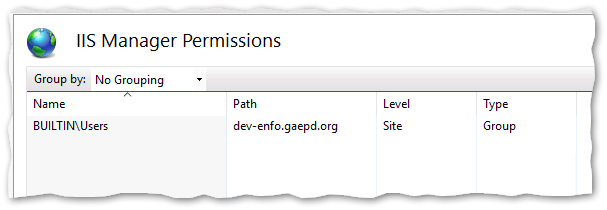

# Web Deploy Setup and Use

Web Deploy is a tool that enables one-click deployment of web applications directly from Visual Studio to the web server, with no need to separately use RDP or FTP. Follow these steps to set it up for each application.

* [Server setup](#server-setup)
* [Application setup](#application-setup)
* [Publishing](#publishing)
* [Optional configuration setup](#optional-configuration-setup)

## Server setup

Open IIS Manager on the web server, select the website you want to configure in the Connections panel, and then open the "IIS Manager Permissions" tool.

Select the "Allow User..." Action.

Select Windows user, then select "Object Types" and enable Groups. Type "Users" in the box and click "Check Names." It should validate the group name. Select OK.

The Users group should display in the IIS Manager Permissions list.

Repeat this for each website on each web server as necessary.

## Application setup

In Visual Studio, you will add a Publishing Profile for each web server destination that you want to publish to.

First, enable the "Web One Click Publish" toolbar in Visual Studio. Select View → Toolbars → Web One Click Publish.

In the Publish toolbar dropdown, select "New Custom Profile...".

Select "IIS, FTP, Web Deploy" as the publish target, then select "Create Profile".

The Publish tool that gets displayed may differ depending on the type of project you are working on, so these screenshots may not match exactly. Fill in the following fields:

* **Server:** Enter either the website URL or server IP address.

* **Site name:** Enter the name of the website as listed in IIS.

* **User name** and **Password:** Leave these blank! You don't want this information in your source code repository. You will be prompted for these every time you publish.

* **Destination URL:** The URL to launch once publishing is successful.

Select "Validate Connection" to test the settings. *Note: You will log in with your SEI server credential, not your SOG credentials.*

Save the profile, which will create an XML file in your project with your settings. You can rename the profile, edit it, and create additional profiles from within the Visual Studio Publish screen.

Note that some settings can be changed using the UI in Visual Studio, but other settings may need to be changed by directly editing the XML file.

Commit the new Publish Profile into your Git repository. Make sure your project `.gitignore` file is set to ignore `*.user` but NOT `*.pubxml`.

Repeat for each web server destination you want to publish to (e.g., Dev, UAT, & Prod).

## Publishing

To publish your website, select the desired profile in the Publish toolbar dropdown, and click the globe icon. You will then be requested to enter your user name and password.

## Optional configuration setup

Optionally, you can set up [`Web.config` file transformations](https://docs.microsoft.com/en-us/aspnet/web-forms/overview/deployment/visual-studio-web-deployment/web-config-transformations) for settings that differ between publication destinations. Transformation files uses the [XDT transformation syntax](https://weblogs.asp.net/srkirkland/common-web-config-transformations-with-visual-studio-2010) to overwrite portions of the `Web.config` file when publishing. Repeat for each web server destination you want to publish to (e.g., Dev, UAT, & Prod).
