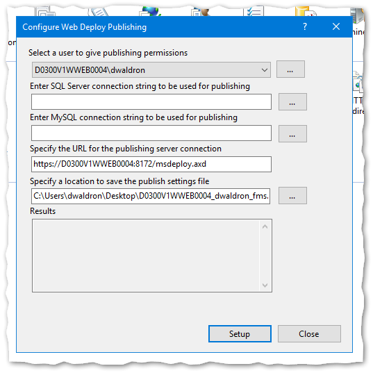

# Web Deploy Setup and Use

Web Deploy is a tool that enables one-click deployment of web applications directly from Visual Studio to the web server, with no need to separately use RDP or FTP. Follow these steps to set it up for each application.

* [IIS setup](#iis-setup)
* [Visual Studio setup](#visual-studio-setup)
* [Publishing](#publishing)
* [Optional configuration setup](#optional-configuration-setup)

## IIS Setup

Open IIS Manager on the web server, right-click on the website you want to configure in the Connections panel, and select Deploy ▶ "Configure Web Deploy Publishing…"

Ensure your user account is selected in the first drop-down and select "Setup", then "Close".

This will configure the website to enable Web Deploy from your account. It will also create a file on the Desktop that is not needed and can be deleted.

Repeat this for each website on each web server as necessary.

## Visual Studio Setup

In Visual Studio, you will need a Publishing Profile for each web server destination that you want to publish to. First, enable the "Web One Click Publish" toolbar in Visual Studio. Select View ▶ Toolbars ▶ "Web One Click Publish".

In the Publish toolbar dropdown, select "New Custom Profile...".

Select "IIS, FTP, Web Deploy" as the publish target, then select "Create Profile".

The Publish tool that gets displayed may differ depending on the type of project you are working on, so these screenshots may not match exactly. Fill in the following fields:

* **Server:** Enter either the website URL or server IP address.

    **IMPORTANT:** Production URLs cannot be used for Web Deploy. Instead, you should use `sei1.gaepd.org` for Prod App&nbsp;1 or `sei2.gaepd.org` for Prod App&nbsp;2.

* **Site name:** Enter the name of the website *as listed in IIS.*

* **User name** and **Password:** *Leave these blank!* You don't want this information in your source code repository. You will be prompted for these when you publish.

* **Destination URL:** The address of your website. Once publishing is successful, this URL will be launched in your default browser.

Select "Validate Connection" to test the settings. *Note: Enter your SEI server credentials, not your SOG credentials.*

Save the profile. Visual Studio will create an XML file in your project with these settings. You can rename the profile, edit it, and create additional profiles from within the Visual Studio "Publish" screen.

Note that some settings can be changed using the UI in Visual Studio, but other settings may need to be changed by directly editing the XML file.

Commit the new Publish Profile into your Git repository. Make sure your project `.gitignore` file is set to ignore `*.user` but NOT ignore `*.pubxml`.

Repeat for each web server destination you want to publish to (e.g., Dev, UAT, & Prod).

## Publishing

To publish your website, select the desired profile in the Publish toolbar dropdown, and click the globe icon. You will be requested to enter your user name and password. *Note: Enter your SEI server credentials, not your SOG credentials.*

## Optional configuration setup

Optionally, you can set up [`Web.config` file transformations](https://docs.microsoft.com/en-us/aspnet/web-forms/overview/deployment/visual-studio-web-deployment/web-config-transformations) for settings that differ between publication destinations. Transformation files uses the [XDT transformation syntax](https://weblogs.asp.net/srkirkland/common-web-config-transformations-with-visual-studio-2010) to overwrite portions of the `Web.config` file when publishing. Repeat for each web server destination you want to publish to (e.g., Dev, UAT, & Prod).
