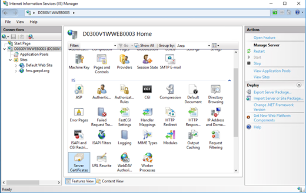
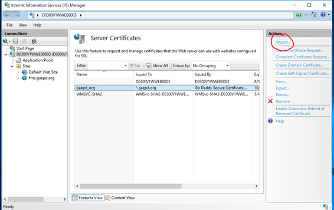

# Creating and installing a new SSL certificate

Follow these steps to create a new SSL certificate and install it on one of the web servers.

1. [Generate a Certificate Signing Request](https://support.godaddy.com/help/iis-10windows-server-2016-generate-csrs-certificate-signing-requests-27348) (CSR) on the web server.

2. Purchase and [request an SSL certificate](https://support.godaddy.com/help/request-my-ssl-certificate-with-a-certificate-signing-request-csr-40441) from GoDaddy.

3. Download and [manually install the SSL certificate](https://support.godaddy.com/help/manually-install-an-ssl-certificate-on-my-iis-10-server-27349) on the web server that was used in step 1.

Then, follow the instructions below to export the certificate and install it on the remaining web servers.

## Export SSL Certificate using IIS

1.	Go to **Start >> Administrative Tools >> Internet Information Services (IIS) Manager**.
2.	Select the server on which the certificate is installed.
3.	Choose the **Server Certificates** option on the central menu:

    

4.	Right-click on the needed certificate and select **Export**.

    

5.	Specify the filename, location, and PFX export password and click **OK**:

    

A PFX file has now been exported and can be found in the specified location. Importing a certificate on a new server can be also performed by using either Microsoft Management Console or IIS Manager.

## Import PFX using IIS Manager

1.	Launch Internet Information Services Manager (**Start >> Administrative Tools >> Internet Information Services (IIS) Manager**) and choose the server the certificate should be imported to.
2.	Double-click **Server Certificates** in the central menu.

    

3.	Click the **Import** button in the right-hand menu:

    

4.	Locate the PFX file on your machine and specify the password that was used when exporting the certificate. Optionally, you may check **Allow this certificate to be exported**. Then, click **OK**:

    

### Assigning a certificate to a website

Once the certificate has been imported by any of the methods described above, it will be shown in the list of server certificates in IIS Manager.

After that, please make sure to complete the **binding** of the certificate to a specific website.
 

***Note:*** *Usually, there is no need to restart the server, so after the SSL certificate has been installed and the binding created, your site should show new certificate, if not then restart the server and test again.*
