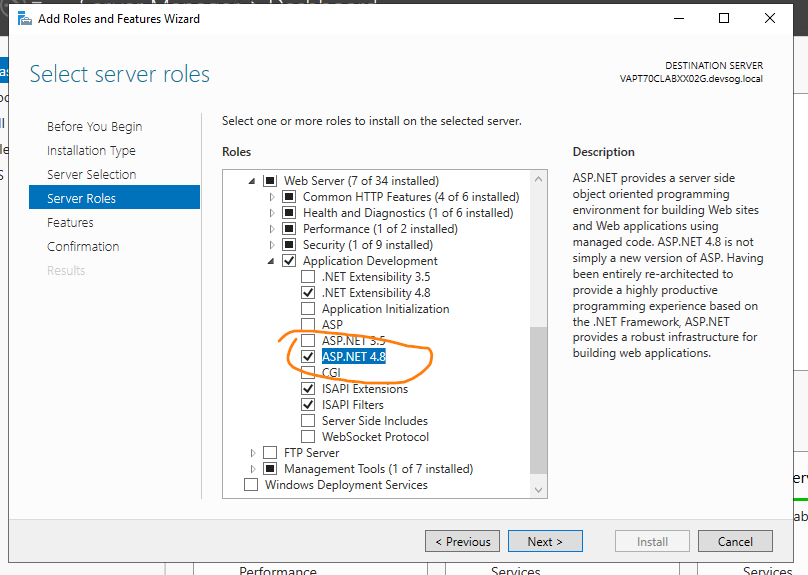

The following additional software must be installed on the web servers.

## .NET

In the Server Manager, install the ASP.NET server role:

Install the latest supported version of the [.NET Framework](https://dotnet.microsoft.com/download/dotnet-framework).

Install the latest LTS version of [.NET](https://dotnet.microsoft.com/download/dotnet). Use the ASP.NET Core Runtime, Windows Hosting Bundle installer.

## Server components and other software

- [SSL Certificates](ssl-certificates.html)
- [Web Deploy IIS module](https://www.iis.net/downloads/microsoft/web-deploy) – Choose "Complete" installation
- [URL Rewrite IIS module](https://www.iis.net/downloads/microsoft/url-rewrite)
- [Raygun APM Agent](https://raygun.com/documentation/product-guides/apm/downloads/) – Only on production web servers
- [VES Connector Service](https://ves.epa.gov/vesa/Node/Reference) – Only on the servers that interact with VES
- Crystal Reports
- Active Directory Authentication Library
- [Notepad++](https://notepad-plus-plus.org/downloads/)
- MS ODBC Driver
- SSRS reports
- ESRI ArcGIS Server
- [OpenNode2](https://windsorsolutions.github.io/opennode2/)
